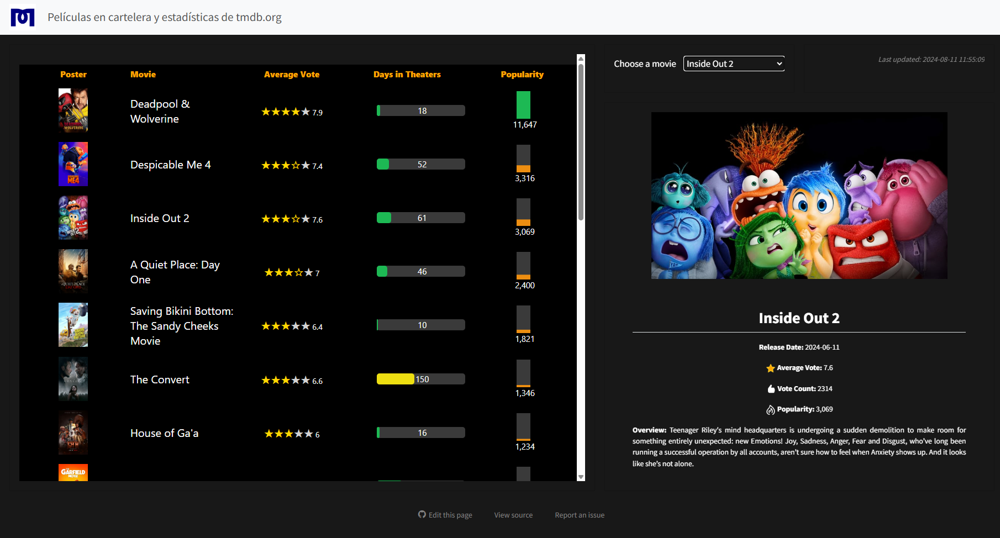

# Quarto + Github Actions + API daily request

Demostración de las capacidades de Quarto y GitHub Actions para la extraccion automatizada de datos de origen API y visualizaros con dashboards interactivos. Todo este proyecto fue realizado con herramientas libres. Por lo que se puede usar para diversos fines de automatización sin costo.

## 🛠️ Tecnologías Implementadas

- **GitHub Actions**: Automatización y despliegue continuo
- **Renv**: Gestión de entornos en R
- **APIs**: Obtención de datos automatizados
- **GT Tables**: Tablas interactivas y estilizadas
- **Quarto**: Framework para publicación técnica y científica

Se tomo la api de peliculas de [tmdb.org](tmdb.org) para fines de demostración, el proceso se puede replicar a cualquier API.

Dashboard ilustrativo disponible [aquí](https://ronaldmego.github.io/quarto-dashboard-movies/dashboard.html)

*¿Interesado en más contenido sobre Data Analytics y desarrollo profesional? No dudes en conectar conmigo en [Mis Redes](https://ronaldmego.github.io/contact/).*